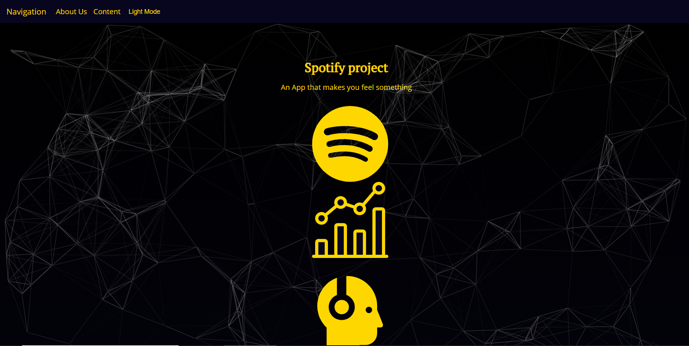

## Lefye- An App that Brings Users Closer to the Sound

By Jacob Somer (frontend) and Zachary Myers (backend), this project provides personalized insights into users' music tastes. 

### Steps
1. sign into your Spotify
2. Explore top artists, personalized music reccomendations, and unique analytics about your favorite music

Explore the Alpha Version by clicking [here](https://lefye.herokuapp.com). 

<em>Note *Lefye is currently using the free version of Heroku so we appreciate your patience with server</em>

